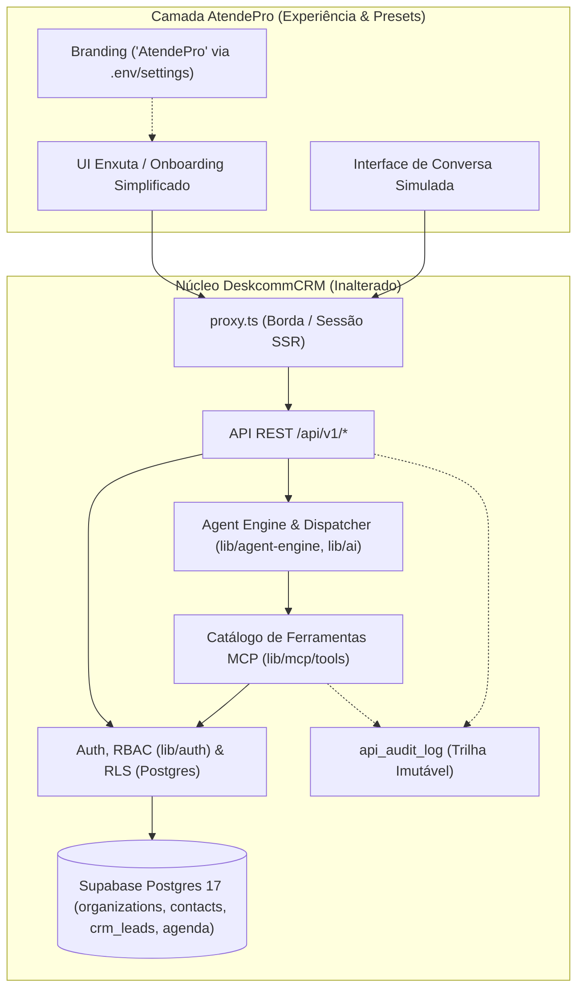
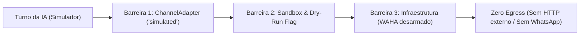
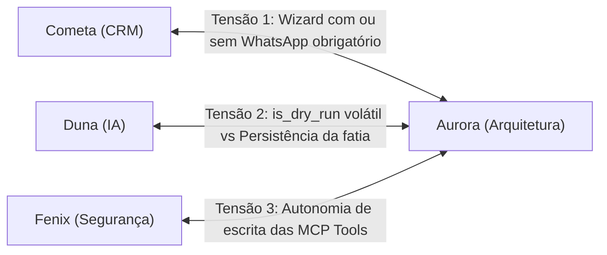

# Contrato de Arquitetura — AtendePro (Primeira Fatia Vertical)

> Precedência: `contract-cross-review.md` é a reconciliação canônica para nomes do schema, provider `simulator`, persistência e limites entre preview e simulação.

> **Documento de Governança Técnica — AtendePro**  
> **Papel Responsável**: Aurora (Arquitetura e Integrações)  
> **Data**: 2026-09-13  
> **Workspace Canônico**: `C:\teste\DeskcommCRM-canonical` (`/mnt/c/teste/DeskcommCRM-canonical`)  
> **Baseline de Referência**: `ca2eb0a` (branch `main`)  
> **Status**: Proposta para alinhamento com Maestro, Cometa, Duna, Eclipse, Fenix e Boreal  

---

## 1. Contexto e Princípios de Arquitetura

O AtendePro é uma camada de experiência simplificada, presets de configuração e *white-label* construída sobre o DeskcommCRM, projetada para atender pequenos negócios e prestadores de serviços que operam por mensagens.

Conforme estabelecido nas decisões **D-001** e **D-002** ([`docs/atendepro/decisions.md`](file:///mnt/c/teste/DeskcommCRM-canonical/docs/atendepro/decisions.md)):
1. **Motor Único**: O DeskcommCRM é o motor operacional soberano. Não serão criadas novas tabelas paralelas de contatos, conversas, leads, funis, tarefas, agenda ou auditoria.
2. **Camada de Apresentação e Configuração**: O nome "AtendePro" é tratado como configuração de marca via [`lib/branding.ts`](file:///mnt/c/teste/DeskcommCRM-canonical/lib/branding.ts) e `organizations.settings.branding`, sem contaminação de código estrutural ou regras de negócio.
3. **Simulação Antes de Produção (D-004)**: A primeira fatia vertical opera em ambiente 100% local e simulado, com zero egress para canais reais de WhatsApp ou provedores pagos não autorizados.
4. **Separação de Agentes (D-005)**: Os agentes Maestri (Aurora, Boreal, Cometa, Duna, Eclipse, Fenix) governam o desenvolvimento e a arquitetura; os agentes nativos do DeskcommCRM executam o atendimento e ações no produto através das APIs e contratos existentes.

---

## 2. Fronteiras Arquiteturais com o DeskcommCRM

A fronteira entre o AtendePro e o núcleo do DeskcommCRM é estrita:



### O que o AtendePro toca:
- Configuração de marca (`APP_NAME=AtendePro`, `APP_LOGO_URL`) consumida nativamente por [`lib/branding.ts`](file:///mnt/c/teste/DeskcommCRM-canonical/lib/branding.ts).
- Presets de onboarding: formulários simplificados para dados da empresa, horário de funcionamento e serviços/preços.
- Interface de simulação de conversa (chat local do operador/dono ensaiando com seu assistente).
- Ocultação de jargão técnico (RAG, MCP, vetores, tokens, prompts brutos e filas) na interface principal.

### O que o AtendePro NÃO toca:
- Nenhuma alteração nas tabelas core do Supabase Postgres (`organizations`, `contacts`, `conversations`, `messages`, `crm_leads`, `agenda_services`, `agenda_appointments`, `event_log`, `api_audit_log`).
- Nenhuma modificação nas regras duras de segurança (RLS com `fn_user_org_ids()`, RBAC com [`requireRole()`](file:///mnt/c/teste/DeskcommCRM-canonical/lib/auth/require-role.ts), criptografia de credenciais).
- Nenhuma alteração no contrato de wire das 16+ tools MCP existentes em [`lib/mcp/tools/catalogo/`](file:///mnt/c/teste/DeskcommCRM-canonical/lib/mcp/tools/catalogo).

---

## 3. Pontos de Entrada Reais do Sistema

A fatia vertical opera exclusivamente através dos pontos de entrada canônicos já existentes no DeskcommCRM:

| Ponto de Entrada | Tipo | Caminho Físico | Contrato / Papel |
|---|---|---|---|
| **Borda / Sessão** | Middleware Next 16 | [`proxy.ts`](file:///mnt/c/teste/DeskcommCRM-canonical/proxy.ts) | Injeta `X-Request-Id`, resolve cookie `sb-deskcomm-auth`, barra acessos não autenticados fora de rotas públicas. |
| **Configuração da Empresa** | REST Handler | `PATCH /api/v1/settings/organization` ([`app/api/v1/settings/organization/route.ts`](file:///mnt/c/teste/DeskcommCRM-canonical/app/api/v1/settings/organization/route.ts)) | Papel mínimo: `admin`. Grava nome comercial, fuso horário, telefone visível e `branding`. |
| **Cadastro de Serviços** | REST Handler | `POST /api/v1/agenda/services` ([`app/api/v1/agenda/services/route.ts`](file:///mnt/c/teste/DeskcommCRM-canonical/app/api/v1/agenda/services/route.ts)) | Papel mínimo: `admin`. Cria serviços com nome, duração em minutos, preço em centavos (`price_cents`) e disponibilidade. |
| **Configuração do Assistente** | REST Handler | `POST /api/v1/ai/agents` / `POST /api/v1/ai/agents/:id/versions` ([`app/api/v1/ai/agents/route.ts`](file:///mnt/c/teste/DeskcommCRM-canonical/app/api/v1/ai/agents/route.ts)) | Papel mínimo: `admin`. Configura prompt de atendimento, tom de voz e tools de agenda habilitadas. |
| **Turno do Simulador** | REST Handler | `POST /api/v1/ai/agents/:id/versions/:vid/test` ([`app/api/v1/ai/agents/[id]/versions/[vid]/test/route.ts`](file:///mnt/c/teste/DeskcommCRM-canonical/app/api/v1/ai/agents/[id]/versions/[vid]/test/route.ts)) | Papel mínimo: `admin`. Executa `testAgentVersion` em sandbox com `is_dry_run: true` e avaliação de guardrails. |
| **Conversa e Mensagens Locais** | REST Handlers | `POST /api/v1/conversations` e `POST /api/v1/messages` ([`app/api/v1/conversations/route.ts`](file:///mnt/c/teste/DeskcommCRM-canonical/app/api/v1/conversations/route.ts), [`app/api/v1/messages/route.ts`](file:///mnt/c/teste/DeskcommCRM-canonical/app/api/v1/messages/route.ts)) | Usado quando a simulação requer persistência visual na timeline do CRM sob canal local/simulado. |

---

## 4. Ownership e Ciclo de Vida das Entidades

Toda entidade manipulada na fatia vertical possui um único dono (`organization_id`) e obedece a uma hierarquia estrita de ciclo de vida:

```
organizations (Tenant Raiz)
 ├── users / user_organizations (Membros e Roles: admin, manager, agent, viewer)
 ├── agenda_services (Serviços, Duração, Preço)
 ├── ai_agents (Definição do Atendente Virtual)
 │    └── ai_agent_versions (Versão publicada com prompt e tool_ids)
 ├── contacts (Identidade do Cliente Sintético ou Real)
 │    ├── crm_leads (Oportunidade no Funil / Pipeline)
 │    ├── conversations (Sessão de Atendimento)
 │    │    └── messages (Mensagens trocadas no turno)
 │    └── agenda_appointments (Compromissos agendados)
 └── api_audit_log (Registro de mutações auditadas)
```

### Regras de Propriedade:
1. **`organizations` (Tenant)**:
   - Toda query DEVE ser filtrada por `organization_id`.
   - No cliente autenticado, a RLS do Postgres aplica o filtro via `fn_user_org_ids()`.
   - Em operações que utilizam `createAdminClient()`, o `organization_id` **DEVE ser resolvido exclusivamente do contexto seguro** (`activeOrg.orgId`), nunca de payloads de entrada (Regra dura do [`CLAUDE.md`](file:///mnt/c/teste/DeskcommCRM-canonical/CLAUDE.md)).
2. **`contacts` (Clientes)**:
   - Na simulação local, o cliente de teste utiliza um identificador sintético reservado (ex.: telefone no range E.164 reservado para testes: `+5511999990001` ou `wa_identity: "simulated:lead-001"`).
   - O contato herda as travas de proteção: se `is_blocked = true` ou `force_human = true`, a IA não responde de forma autônoma.
3. **`conversations` & `messages`**:
   - Pertencem simultaneamente a uma organização e a um contato.
   - Vinculam-se a uma sessão de canal (`channel_session_id`).
   - Carregam metadados de governança (Spec 13/14): `assignee_kind` (`"ai"` ou `"human"`), `assigned_to_user_id` e `queue_position`.
4. **`crm_leads`**:
   - Representa o progresso no funil. Criado automaticamente ou via tool `crm_create_lead` ([`lib/mcp/tools/catalogo/funil.ts`](file:///mnt/c/teste/DeskcommCRM-canonical/lib/mcp/tools/catalogo/funil.ts)).
   - Estágios (`stage_id`) pertencem ao pipeline padrão da organização.
5. **`agenda_services` & `agenda_appointments`**:
   - `agenda_services`: Catálogo de ofertas do pequeno negócio.
   - `agenda_appointments`: Criado quando o assistente fecha a reserva via `crm_book_appointment` ([`lib/mcp/tools/agendamento.ts`](file:///mnt/c/teste/DeskcommCRM-canonical/lib/mcp/tools/agendamento.ts)). Contém `start_time`, `end_time`, `service_id`, `contact_id` e status (`pending`, `confirmed`, `cancelled`).

---

## 5. Canal Simulado Zero-Egress

Para cumprir **D-004** e mitigar **B-004** (Bloqueio de WhatsApp real), a arquitetura estabelece contenção física e lógica total contra egressos de rede:

### 5.1. Tripla Barreira de Contenção Zero-Egress



1. **Barreira 1 — ChannelAdapter Seam**:
   - Conforme especificado em [`lib/agent-engine/channel-adapter.ts`](file:///mnt/c/teste/DeskcommCRM-canonical/lib/agent-engine/channel-adapter.ts), o envio de mensagens pelo motor de agentes passa obrigatoriamente por um `ChannelAdapter`.
   - O canal simulado utiliza um `SimulatedChannelAdapter` cujo método `send()` grava a mensagem diretamente no banco local (`messages`) ou a devolve no stream HTTP da tela de teste, **sem acionar nenhum transporte HTTP externo**.
2. **Barreira 2 — Configuração de Sessão de Canal**:
   - A sessão de canal da organização de teste é cadastrada com `channel_provider = 'simulated'` (ou permanece sem sessão WAHA vinculada).
   - O dispatcher nativo pula instâncias que não possuem canal ativo ou que estejam em modo de teste.
3. **Barreira 3 — Desarmamento Físico de Infraestrutura**:
   - A variável `WAHA_API_URL` permanece vazia/não definida no ambiente de desenvolvimento local.
   - Em [`lib/waha/send.ts#L64-L68`](file:///mnt/c/teste/DeskcommCRM-canonical/lib/waha/send.ts#L64-L68), `sendWAHA()` verifica `getWahaClient()`, que retorna `null` e encerra a chamada silenciosamente como no-op se a URL não estiver presente.

### 5.2. Modo de Execução da IA sem Custos
- A fatia suporta execução com `INTERNAL_AGENT_RUN_STUB=true` ([`app/api/v1/ai/agents/[id]/versions/[vid]/test/route.ts#L8-L10`](file:///mnt/c/teste/DeskcommCRM-canonical/app/api/v1/ai/agents/%5Bid%5D/versions/%5Bvid%5D/test/route.ts#L8-L10)), gerando traces e invocações de ferramentas simuladas sem disparar chamadas para Anthropic, OpenAI ou Google até que o dono configure explicitamente uma chave de desenvolvimento.

---

## 6. Fluxo de Leitura e Mutação Auditada

Todo acesso e modificação de estado segue o protocolo inegociável de segurança da plataforma:

```
Requisição (Usuário ou Simulador)
  │
  ├── 1. Validação de Sessão & RBAC: requireRole("admin" | "agent", { resource })
  │      └── Falha: HTTP 401 / 403 padronizado
  │
  ├── 2. Resolução do Tenant: activeOrg.orgId derivado confiavelmente da sessão
  │
  ├── 3. Validação de Payload: Schema Zod (ex: testRunSchema, serviceSchema)
  │      └── Falha: HTTP 422 validation_failed
  │
  ├── 4. Mutação com Idempotência:
  │      ├── Uso de Idempotency-Key ou chaves únicas (ex: organization_id + external_id)
  │      └── Escopo obrigatório de organization_id na query
  │
  ├── 5. Auditoria Obrigatória:
  │      └── audit({ action, organizationId, resourceType, resourceId, requestId })
  │          (Gravação append-only em api_audit_log via lib/audit/index.ts)
  │
  └── 6. Disparo Assíncrono de Eventos:
         └── Inserção em event_log (sem triggers HTTP síncronos)
```

---

## 7. Dependências e Pré-Requisitos Técnicos

Para a execução da primeira fatia vertical local:

1. **Banco de Dados**:
   - Supabase Postgres 17 local com extensão `pgvector`.
   - Migrations canônicas aplicadas (até a baseline `0238_convites_de_time_persistidos.sql`).
   - Esquemas obrigatórios presentes: `organizations`, `user_organizations`, `agenda_services`, `agenda_appointments`, `ai_agents`, `ai_agent_versions`, `contacts`, `crm_leads`, `conversations`, `messages`, `api_audit_log`, `event_log`.
2. **Toolchain do Host (Mitigação do Bloqueio B-001)**:
   - Node 22 LTS (via nvm ou container local dedicado).
   - `pnpm 9.15.9` (com respeito rigoroso aos overrides e patches do [`package.json`](file:///mnt/c/teste/DeskcommCRM-canonical/package.json)).
3. **Ambiente Local (`.env.local`) Mínimo**:
   ```env
   NODE_ENV=development
   APP_NAME=AtendePro
   APP_LOGO_URL=
   SUPABASE_URL=http://127.0.0.1:54321
   SUPABASE_ANON_KEY=<anon-key-local>
   SUPABASE_SERVICE_ROLE_KEY=<service-role-key-local>
   INTERNAL_AGENT_RUN_STUB=true
   # WAHA_API_URL mantido OBRIGATORIAMENTE VAZIO
   ```

---

## 8. Cruzamento com os Papéis e Divergências Explícitas

Abaixo constam as posições alinhadas e as divergências técnicas identificadas entre Aurora (Arquitetura), Cometa (CRM/Onboarding), Duna (IA/Simulação) e Fenix (Segurança/RLS):



### 8.1. Cruzamento com Cometa (CRM & Onboarding)
- **Consenso**: O onboarding do AtendePro deve ser centrado no prestador de serviço (1. Negócio e Horário, 2. Serviço e Preço, 3. Conversa Simulada).
- **DIVERGÊNCIA IDENTIFICADA (D-ARCH-01)**:
  - *Cometa*: Defende eliminar completamente o passo de WhatsApp do fluxo inicial do AtendePro para não gerar fricção ou dependência de escaneamento de QR Code.
  - *Estrutura Atual*: [`lib/onboarding/passos.ts#L60`](file:///mnt/c/teste/DeskcommCRM-canonical/lib/onboarding/passos.ts#L60) define o passo `connect-whatsapp` com `existe: () => true` incondicional.
  - *Decisão Arquitetural*: O AtendePro não deve reescrever o arquivo `passos.ts`. O contrato estabelece que a interface do AtendePro passará a flag de contexto `{ lojaLigada: false, modoAtendePro: true }` ou marcará o passo de WhatsApp como `skipped: true` automaticamente no estado do onboarding, ativando imediatamente o passo `testar` ("Ver ele atender") como a experiência de conclusão.

### 8.2. Cruzamento com Duna (IA, RAG e Simulação)
- **Consenso**: O ensaio da conversa deve ser realizado reutilizando o sandbox [`lib/agent-engine/agent/sandbox.ts`](file:///mnt/c/teste/DeskcommCRM-canonical/lib/agent-engine/agent/sandbox.ts) e as tools de agendamento de [`lib/mcp/tools/catalogo/agendamento.ts`](file:///mnt/c/teste/DeskcommCRM-canonical/lib/mcp/tools/catalogo/agendamento.ts).
- **DIVERGÊNCIA IDENTIFICADA (D-ARCH-02)**:
  - *Duna*: O endpoint de teste atual (`POST /api/v1/ai/agents/:id/versions/:vid/test`) roda com `is_dry_run: true`. Nesse modo, o sandbox **não persiste** contato, não cria conversa e não insere a linha na tabela `agenda_appointments` (as tools são executadas apenas em memória/trace para validação de guardrails).
  - *Necessidade da Fatia Vertical*: Para que o usuário veja a "fatia vertical completa" (conversa gerando agendamento visível na agenda e lead no funil), os dados precisam existir no banco.
  - *Decisão Arquitetural*: A primeira fatia vertical adotará um **duplo estágio**:
    1. **Estágio A (Ensaio Rápido)**: Usa o `is_dry_run: true` nativo para testar o diálogo e a resposta do atendente sem alterar o banco.
    2. **Estágio B (Simulação Persistida no CRM)**: O simulador cria uma conversa vinculada a uma sessão local (`channel_provider = 'simulated'`) com contato de teste (`is_test = true`). As tools MCP rodam de forma real contra o banco do tenant de teste, gerando o agendamento em `agenda_appointments` e a auditoria em `api_audit_log`, mas com o canal configurado para **zero egress** (sem envio para rede externa).

### 8.3. Cruzamento com Fenix (Segurança, RLS e Auditoria)
- **Consenso**: Nenhuma mutação sem tenant, nenhum handler aceitando `organization_id` do cliente, e todas as ações gravadas em log auditável.
- **DIVERGÊNCIA IDENTIFICADA (D-ARCH-03)**:
  - *Fenix*: Alerta que a execução de tools de escrita por agentes internos em background pode causar mutações acidentais caso o modelo "alucine" parâmetros de agendamento em horários já ocupados ou sobrescreva dados de contatos existentes.
  - *Duna*: Quer autonomia total para que o assistente conclua agendamentos diretamente na conversa.
  - *Decisão Arquitetural*: A tool `crm_book_appointment` já possui validação de conflito de horário e lock atômico no banco. O contrato de arquitetura estabelece que:
    - O agente opera sob o papel restrito `ai_operator` ([`lib/auth/types.ts#L23`](file:///mnt/c/teste/DeskcommCRM-canonical/lib/auth/types.ts#L23)).
    - Mutações geradas pelo simulador gravam `metadata.simulated = true` no `api_audit_log`.
    - Agendamentos simulados recebem a flag ou metadado de teste, permitindo fácil identificação e limpeza sem poluir dados operacionais reais.

---

## 9. Resumo da Primeira Fatia Vertical para o Maestro

| Passo | Agente Responsável | Ação Técnica Definida no Contrato |
|---|---|---|
| **1. Configuração do Negócio** | Cometa / Boreal | Salvar nome da empresa, fuso horário e criar 1 serviço em `agenda_services` via APIs oficiais. |
| **2. Ativação do Assistente** | Duna | Criar versão inicial do agente em `ai_agent_versions` com o prompt do negócio e tools de agenda ativadas (`crm_check_availability`, `crm_book_appointment`). |
| **3. Conversa Simulada** | Boreal / Duna | Interface web envia mensagem simulada (*"Quero agendar amanhã às 14h"*). Runtime processa com `INTERNAL_AGENT_RUN_STUB=true` ou provedor configurado. |
| **4. Agendamento & Auditoria** | Aurora / Fenix | Tool executa, valida disponibilidade, insere em `agenda_appointments` e gera registro em `api_audit_log`. Zero egress de WhatsApp. |
| **5. Verificação de Entrega** | Eclipse | QA valida que o agendamento aparece na tela de agenda e que nenhum pacote HTTP saiu para a rede externa. |
