# Contrato de CRM, Onboarding e Operação — AtendePro (Primeira Fatia Vertical)

> Precedência: `contract-cross-review.md` é a fonte canônica para entidades, rotas, preset por vínculo e fronteira do simulador.

> **Documento de Governança Técnica — AtendePro**  
> **Papel Responsável**: Cometa (CRM, Onboarding e Fluxos Operacionais)  
> **Data**: 2026-09-13  
> **Workspace Canônico**: `C:\teste\DeskcommCRM-canonical` (`/mnt/c/teste/DeskcommCRM-canonical`)  
> **Baseline de Referência**: `ca2eb0a` (branch `main`)  
> **Status**: Proposta de Contrato para Alinhamento com Maestro, Aurora, Duna, Eclipse, Fenix e Boreal  
> **Documentos de Ancoragem**:  
> - [`docs/atendepro/project-brief.md`](file:///mnt/c/teste/DeskcommCRM-canonical/docs/atendepro/project-brief.md)  
> - [`docs/atendepro/project-state.md`](file:///mnt/c/teste/DeskcommCRM-canonical/docs/atendepro/project-state.md)  
> - [`docs/atendepro/decisions.md`](file:///mnt/c/teste/DeskcommCRM-canonical/docs/atendepro/decisions.md)  
> - [`docs/atendepro/blockers.md`](file:///mnt/c/teste/DeskcommCRM-canonical/docs/atendepro/blockers.md)  
> - [`docs/atendepro/architecture-contract.md`](file:///mnt/c/teste/DeskcommCRM-canonical/docs/atendepro/architecture-contract.md) (Aurora)  
> - [`docs/atendepro/simulation-contract.md`](file:///mnt/c/teste/DeskcommCRM-canonical/docs/atendepro/simulation-contract.md) (Duna)  
> - [`docs/atendepro/qa-contract.md`](file:///mnt/c/teste/DeskcommCRM-canonical/docs/atendepro/qa-contract.md) (Eclipse)  
> - [`docs/atendepro/security-contract.md`](file:///mnt/c/teste/DeskcommCRM-canonical/docs/atendepro/security-contract.md) (Fenix)  
> - [`docs/atendepro/ux-contract.md`](file:///mnt/c/teste/DeskcommCRM-canonical/docs/atendepro/ux-contract.md) (Boreal)  

---

## 1. Contexto e Escopo de Atuação da Frente Cometa

O **AtendePro** é uma camada de experiência e configuração simplificada sobre o motor do **DeskcommCRM** para pequenos negócios e prestadores de serviços que atendem por mensagens.

A responsabilidade desta frente (**Cometa**) abrange:
1. **Fluxos de CRM**: Gestão de contatos (`contacts`), oportunidades e funis (`crm_pipelines`, `crm_stages`, `crm_leads`), histórico de atividades (`crm_lead_activities`) e quadro visual (Kanban).
2. **Onboarding Guiado**: Experiência de partida simplificada (`/onboarding/*`), permitindo que o dono configure seu negócio, monte seu funil, treine seu atendente virtual e ensaie antes de receber clientes reais.
3. **Agenda e Agendamento**: Gerenciamento de tipos de compromissos (`calendar_event_types`), compromissos agendados (`calendar_appointments`), disponibilidade semanal e bloqueios (`calendar_availability_exceptions`).
4. **Governança Operacional**: Handoff humano (`crm_request_human_handoff`), controle de status do atendente (ativo/pausado) e supervisão por operadores sem contato com detalhes técnicos internos.

---

## 2. Nomenclatura Canônica do Schema (Prevenção de Divergências)

Para eliminar qualquer ambiguidade identificada em rascunhos anteriores e manter estrita aderência ao código e migrações oficiais do DeskcommCRM:

| Nome Incorreto / Apócrifo | Nome Real Canônico no Repositório | Arquivo de Origem no Banco |
|---|---|---|
| `agenda_services` | **`calendar_event_types`** | [`supabase/migrations/20260826190000_0177_agenda_o_compromisso_marcado.sql:90`](file:///mnt/c/teste/DeskcommCRM-canonical/supabase/migrations/20260826190000_0177_agenda_o_compromisso_marcado.sql#L90) |
| `agenda_appointments` / `crm_appointments` | **`calendar_appointments`** | [`supabase/migrations/20260826190000_0177_agenda_o_compromisso_marcado.sql:197`](file:///mnt/c/teste/DeskcommCRM-canonical/supabase/migrations/20260826190000_0177_agenda_o_compromisso_marcado.sql#L197) |
| `agenda_exceptions` | **`calendar_availability_exceptions`** | [`supabase/migrations/20260826190000_0177_agenda_o_compromisso_marcado.sql:343`](file:///mnt/c/teste/DeskcommCRM-canonical/supabase/migrations/20260826190000_0177_agenda_o_compromisso_marcado.sql#L343) |
| `crm_products` (termo coloquial de produto) | **`catalog_products`** | [`supabase/migrations/20260901120000_0204_catalogo_de_produtos_da_loja.sql:46`](file:///mnt/c/teste/DeskcommCRM-canonical/supabase/migrations/20260901120000_0204_catalogo_de_produtos_da_loja.sql#L46) |
| `crm_activities` | **`crm_lead_activities`** | [`supabase/migrations/20260721180000_0060_crm_leads.sql`](file:///mnt/c/teste/DeskcommCRM-canonical/supabase/migrations/20260721180000_0060_crm_leads.sql) |

> [!IMPORTANT]
> É expressamente vedado criar tabelas alternativas como `agenda_services` ou `crm_appointments`. Todas as frentes técnicas devem operar exclusivamente sobre `calendar_event_types` e `calendar_appointments`.

---

## 3. Cross-Check Multidisciplinar com as Outras Frentes

### 3.1. Alinhamento com Aurora (Arquitetura)
- **Princípio D-001 e D-002**: O DeskcommCRM permanece como único motor operacional. Não há replicação de tabelas ou serviços de CRM.
- **Fronteira Arquitetural**: A camada AtendePro consome a API REST canônica (`/api/v1/contacts`, `/api/v1/pipelines`, `/api/v1/agenda/*`) e Server Actions de onboarding localizadas em [`app/actions/onboarding/`](file:///mnt/c/teste/DeskcommCRM-canonical/app/actions/onboarding).
- **Correção Mútua de Contrato**: Aurora retificou a taxonomia em seu documento para adotar `calendar_event_types` e `calendar_appointments`.

### 3.2. Alinhamento com Duna (IA, Runtime e Simulação)
- **Coexistência de Dois Modos**:
  1. *Prompt Preview (Sandbox)*: Mantido em `/api/v1/ai/agents/:id/versions/:vid/test` para validação rápida de prompts sem efeitos colaterais (`is_dry_run: true`, `contactId: null`).
  2. *Simulador Persistente AtendePro*: Opera sob o canal sintético `simulator` (definido no Contrato de Duna §3 e §4), gerando contato de teste, sessão e mensagens persistidas, permitindo que as chamadas de MCP tools (`crm_create_lead`, `crm_move_lead_stage`, `crm_book_appointment`) tenham efeito visível no CRM e no Kanban.
- **Tools MCP Autorizadas**: O atendente na simulação tem acesso às tools de CRM canônicas registradas em [`lib/mcp/tools/index.ts`](file:///mnt/c/teste/DeskcommCRM-canonical/lib/mcp/tools/index.ts).

### 3.3. Alinhamento com Eclipse (QA, E2E e Determinismo)
- **Critérios CA-01 a CA-07 Cumpridos**: O fluxo da fatia vertical (Onboarding → Regras → Simulação → Kanban) é exercitável 100% localmente sem conexão com WAHA ou Meta.
- **Fixture Determinística**: O teste E2E cria uma organização e usuário de teste, finaliza o onboarding com skip do WhatsApp, executa a conversa simulada e valida que o card do contato surge na coluna correta do Kanban.
- **Limpeza (`afterAll`)**: Todos os registros gerados pela suite de testes sob a organização de teste são isolados e purgados ao final da execução.

### 3.4. Alinhamento com Fenix (Segurança, RLS e RBAC)
- **Tenant Isolation**: Toda query do CRM e do Onboarding valida estritamente `organization_id` derivado da sessão autenticada (`resolveActiveOrg()`), sem aceitar IDs por payload aberto.
- **Zero-Egress Enforcement**: Nenhuma Server Action de CRM ou canal simulado possui acoplamento de saída com gateways externos de rede.
- **Auditoria de Ações da IA**: Toda movimentação de lead ou agendamento realizado pelo agente na simulação é auditada via `audit()` com `actor_kind: 'ai'` e `resourceType: 'crm_lead'` / `'calendar_appointment'`.

### 3.5. Alinhamento com Boreal (UX)
- **Ativação do Preset Simplificado**: A conclusão do onboarding deve registrar `interface_settings = { preset: "simplificada" }`, garantindo que o usuário veja apenas `inbox`, `agenda`, `kanban`, `contacts`, `tasks` e `connections`.
- **Controle Operacional Visível**: Inclusão de indicador e alternador de estado do atendente (Ativo / Pausado) no cabeçalho ou no topo do Inbox simplificado.

---

## 4. Modelagem de Serviços, Tipos de Eventos e Precificação

### 4.1. O que Existe no Schema Atual
1. **`calendar_event_types`** ([`0177:90-171`](file:///mnt/c/teste/DeskcommCRM-canonical/supabase/migrations/20260826190000_0177_agenda_o_compromisso_marcado.sql#L90-L171)):
   - Campos existentes: `id`, `organization_id`, `name`, `slug`, `description`, `category`, `duration_minutes`, `buffer_before_minutes`, `buffer_after_minutes`, `minimum_notice_minutes`, `slot_interval_minutes`, `booking_window_days`, `color`, `location_kind`, `location_details`, `requires_confirmation`, `is_active`, `reminder_enabled`, `reminder_minutes_before`, `reminder_template_name`, `position`, `default_owner_user_id`.
   - **Lacuna Confirmada**: A tabela **NÃO possui coluna de preço** (`price_cents` ou `currency`).
2. **`catalog_products`** ([`0204:46-90`](file:///mnt/c/teste/DeskcommCRM-canonical/supabase/migrations/20260901120000_0204_catalogo_de_produtos_da_loja.sql#L46-L90)):
   - Campos existentes: `id`, `organization_id`, `codigo`, `nome`, `descricao`, `preco_cents`, `moeda`, `custo_cents`, `controla_estoque`, `quantidade`, `ativo`, `origem`.
   - **Propósito**: Projetada para e-commerce e varejo (itens físicos, SKUs e estoque). Não possui duração nem parâmetros de agendamento de agenda.
3. **`calendar_appointments`** ([`0177:197-270`](file:///mnt/c/teste/DeskcommCRM-canonical/supabase/migrations/20260826190000_0177_agenda_o_compromisso_marcado.sql#L197-L270)):
   - Vincula `event_type_id`, `contact_id`, `conversation_id`, `starts_at`, `ends_at`, `time_zone`, `status`, `owner_user_id`, `created_by_kind`, `created_by_agent_id`.

### 4.2. Relação Atual e Opções de Decisão para Precificação de Serviços

Para atender à exigência de "serviços, preços e duração" do AtendePro para prestadores de serviços e clínicas, avaliam-se três caminhos técnicos:

| Opção | Abordagem | Impacto no Schema | Prós | Contras |
|---|---|---|---|---|
| **Opção 1 (Recomendada para Evolução Futura)** | Adicionar `price_cents bigint null` e `currency text not null default 'BRL'` em `calendar_event_types`. | Migration aditiva leve (Doutrina DIRC: evoluir molde existente). | O tipo de evento passa a ser a fonte única da verdade sobre o serviço (duração + preço). | Requer migração de schema no Supabase. |
| **Opção 2 (Vínculo com Catálogo)** | Adicionar `product_id uuid references catalog_products(id)` em `calendar_event_types`. | Migration aditiva com FK. | Reutiliza a tabela de preços do catálogo. | Complexidade desnecessária para prestadores de serviços que não controlam estoque nem operam SKUs. |
| **Opção 3 (Adotada na Fatia Vertical 1 / Zero-Migration)** | Manter o schema intacto. O preço do serviço é informado nas regras da empresa / memória do agente (`org_memory_versions` / prompt) ou via metadados/descrição de `calendar_event_types`. | **Zero migrações**. 100% de respeito à regra de somente leitura e não-modificação de banco desta fase. | Viabiliza a fatia vertical imediatamente sem alterar tabelas congeladas. | Não possui validação estruturada de moeda em nível de coluna SQL. |

> [!NOTE]
> **Decisão Proposta ao Maestro**: Para a Primeira Fatia Vertical, adotar a **Opção 3** (preço definido nas diretrizes do atendente e na descrição do tipo de evento), registrando a **Opção 1** como a evolução canônica formal para a próxima onda de migrações.

---

## 5. Reconciliação: Preview Dry-Run versus Simulador Persistente

Para sanar a divergência entre ensaio isolado e teste ponta a ponta com efeito no CRM:

```mermaid
flowchart TD
    subgraph ModoSandbox["1. Sandbox / Prompt Preview (Existente)"]
        TestUI["TestPanel / setup-ai"] --> API_Test["POST /api/v1/ai/agents/:id/versions/:vid/test"]
        API_Test --> Engine_DryRun["testAgentVersion (is_dry_run: true)"]
        Engine_DryRun --> Policy["preview.ts (preview_no_client_effects)"]
        Policy --> Output_DryRun["Retorna { final_text, proposals: [...] }"]
        Output_DryRun -.-> SemEfeito["NENHUM contato, lead ou mensagem gravada"]
    end

    subgraph ModoSimulador["2. Simulador Persistente AtendePro (Fatia Vertical 1)"]
        ChatUI["Chat do Simulador AtendePro"] --> API_Sim["POST /api/v1/simulator/messages"]
        API_Sim --> Setup_Sim["Garante Contact 'simulado' + ChannelSession 'simulator'"]
        Setup_Sim --> Inbound_Msg["Grava Message (direction: 'inbound')"]
        Inbound_Msg --> Real_Turn["executarTurnoDoAgente (Canal Simulator)"]
        Real_Turn --> Exec_MCP["Executa MCP Tools Reais (crm_create_lead, crm_move_lead_stage)"]
        Exec_MCP --> Mutacao_CRM[("Persiste em crm_leads e crm_lead_activities")]
        Real_Turn --> Outbound_Msg["Grava Message (direction: 'outbound')"]
        Outbound_Msg --> ZeroEgress["Zero-Egress: Bloqueia envio externo de rede"]
        Mutacao_CRM --> Atualiza_Kanban["Card visível e atualizado no Kanban AtendePro"]
    end
```



### 5.1. Regras de Reconciliação
1. **Papel do Preview Dry-Run**: Permanece ativo e inalterado para validação rápida de prompt na edição do agente (evita custos desnecessários e poluição do banco).
2. **Papel do Simulador Persistente**: É o mecanismo oficial da Fatia Vertical AtendePro. Ao interagir no simulador:
   - Um contato sintético (`+5511999990001` ou `wa_identity: "simulated:lead-001"`) é associado à organização.
   - O turno executa as ferramentas do MCP com permissão de escrita no CRM (`crm_create_lead`, `crm_move_lead_stage`, `crm_book_appointment`).
   - A resposta do atendente é persistida na tabela `messages`.
   - O despachador de mensagens detecta o provider `simulator` e não dispara requisições para WAHA ou Meta.
   - O operador abre o Kanban e constata o card do lead criado ou avançado para o estágio correspondente.

---

## 6. Onboarding e Gestão do WhatsApp no AtendePro

### 6.1. O Fluxo de Passos e o Skip de WhatsApp
O wizard de onboarding atual implementado em [`lib/onboarding/passos.ts`](file:///mnt/c/teste/DeskcommCRM-canonical/lib/onboarding/passos.ts) opera com 7 passos ativos:

1. `/onboarding/welcome`: Captura nome fantasia, descrição do negócio e fuso horário.
2. `/onboarding/connect-whatsapp`: Apresenta conexão via QR Code WAHA.
3. `/onboarding/connect-nuvemshop`: Condicional à flag `NUVEMSHOP_ENABLED` (frequentemente falso em prestadores de serviços).
4. `/onboarding/setup-ai`: Seleção de template e criação do agente padrão (`ai_agents`).
5. `/onboarding/funil`: Proposta inteligente de colunas de Kanban adaptadas ao nicho do negócio.
6. `/onboarding/testar`: Ensaio do atendente.
7. `/onboarding/invite-team`: Convite de membros da equipe (skippable).
8. `/onboarding/done`: Conclusão e liberação do acesso.

### 6.2. Regra de Negócio para o WhatsApp no AtendePro (D-004)
- **Local Antes de WhatsApp**: Em conformidade com a decisão **D-004**, nenhum usuário é obrigado a conectar um WhatsApp real para concluir o onboarding do AtendePro.
- **Comportamento do Step 2**:
  - A Server Action [`skipWhatsapp.ts`](file:///mnt/c/teste/DeskcommCRM-canonical/app/actions/onboarding/skipWhatsapp.ts) grava `onboarding_state.whatsapp = { skipped: true }`.
  - Na camada AtendePro, o botão de avanço/skip deve ser promovido como o caminho padrão da experiência local: *"Configurar depois / Testar com simulador local"*.
  - O QR Code só é solicitado quando explicitamente acionado pelo operador com uma instância WAHA homologada.

### 6.3. Aplicação Compulsória do Preset Simplificado
Na Server Action [`finishOnboarding.ts`](file:///mnt/c/teste/DeskcommCRM-canonical/app/actions/onboarding/finishOnboarding.ts#L38-L43):
- Atualmente, a ação atualiza apenas `onboarded_at = now()`.
- **Regra Contratual AtendePro**: A ação `finishOnboarding` deve ser ajustada para gravar simultaneamente:
  ```json
  {
    "onboarded_at": "NOW()",
    "interface_settings": {
      "preset": "simplificada"
    }
  }
  ```
- **Resultado**: Ao ser redirecionado para `/app/inbox` ([`finishOnboarding.ts:63`](file:///mnt/c/teste/DeskcommCRM-canonical/app/actions/onboarding/finishOnboarding.ts#L63)), o menu lateral exibirá estritamente os destinos de negócio:
  - **Inbox** (`/app/inbox`)
  - **Agenda** (`/app/agenda`)
  - **Kanban** (`/app/kanban`)
  - **Contatos** (`/app/contacts`)
  - **Tarefas** (`/app/tasks`)
  - **Conexões** (`/app/connections`)
- As seções técnicas avançadas (`/app/ai/*`, `/app/webhooks`, `/app/integrations`, RAG e MCP) permanecem ocultas, resguardando o Princípio 2 do [`project-brief.md`](file:///mnt/c/teste/DeskcommCRM-canonical/docs/atendepro/project-brief.md#L41).

---

## 7. Matriz de Mutações Auditadas da Fatia Vertical

Toda mutação acionada pelo operador ou pelo atendente virtual deve emitir um evento imutável em `audit_log`:

| Ação de Negócio | Entidade Alvo | Ator (`actor_kind`) | Código do Evento Auditado | Metadados Mínimos |
|---|---|---|---|---|
| Aceite dos Termos & Negócio | `organizations` | `user` | `onboarding.welcome_completed` | `{ display_name, timezone }` |
| Pular Conexão WhatsApp | `organizations` | `user` | `onboarding.whatsapp_skipped` | `{ skipped: true }` |
| Criação do Agente Padrão | `ai_agents` | `user` | `onboarding.ai_configured` | `{ agent_id, template_id }` |
| Configuração do Funil | `crm_pipelines` | `user` | `onboarding.quadro_montado` | `{ pipeline_id, origem, etapas }` |
| Finalização do Onboarding | `organizations` | `user` | `tenant.onboarded` | `{ completed_by: user_id }` |
| Criação de Lead Simulado | `crm_leads` | `ai` / `user` | `crm.lead_created` | `{ contact_id, pipeline_id, stage_id }` |
| Movimentação de Estágio | `crm_leads` | `ai` | `crm.lead_stage_moved` | `{ lead_id, from_stage_id, to_stage_id }` |
| Agendamento de Serviço | `calendar_appointments` | `ai` | `calendar.appointment_booked` | `{ appointment_id, event_type_id, starts_at }` |

---

## 8. Definição de Pronto da Frente Cometa (DoD)

Para a primeira fatia vertical ser considerada entregue pela frente Cometa:
1. Contrato formalizado em `docs/atendepro/crm-contract.md` e alinhado com todas as frentes técnicas.
2. Nomes de schema 100% canônicos verificados contra as migrações oficiais (`calendar_event_types`, `calendar_appointments`, `catalog_products`).
3. Fluxo de onboarding navegável sem travas mesmo com WhatsApp e Nuvemshop desativados.
4. Preset `simplificada` aplicado por default na conclusão do onboarding.
5. Conversa simulada comprovadamente capaz de gerar lead e movimentar card no Kanban do CRM sem qualquer tráfego de rede para provedores externos.
6. Zero edições ilegais em código de produção ou alterações não autorizadas no banco de dados durante a fase de contratos.
