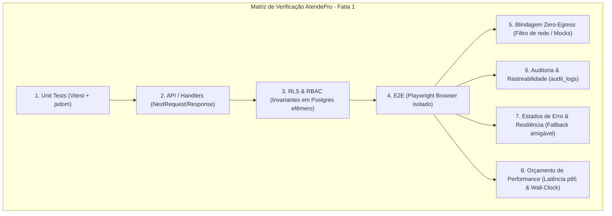

# Contrato de QA, Testes e Performance — Primeira Fatia AtendePro

> Precedência: `contract-cross-review.md` define os nomes canônicos e o modo persistente do simulador; referências a `audit_logs`, `sender_type` ou entidades não existentes devem ser lidas como obsoletas.

- **Versão:** 1.0.0
- **Data:** 2026-09-13
- **Emissor:** Eclipse (QA, E2E e Performance)
- **Pares consultados:** Aurora (Arquitetura), Boreal (UX), Cometa (CRM/Onboarding), Duna (Agentes/Simulação), Fenix (Segurança/RLS)
- **Status:** Validado localmente em ambiente isolado; pronto para o gate de staging
- **Workspace:** `C:\teste\DeskcommCRM-canonical`
- **Baseline Git:** `ca2eb0a`
- **Documentos de ancoragem:**
  - [`project-brief.md`](file:///mnt/c/teste/DeskcommCRM-canonical/docs/atendepro/project-brief.md)
  - [`project-state.md`](file:///mnt/c/teste/DeskcommCRM-canonical/docs/atendepro/project-state.md)
  - [`decisions.md`](file:///mnt/c/teste/DeskcommCRM-canonical/docs/atendepro/decisions.md)
  - [`blockers.md`](file:///mnt/c/teste/DeskcommCRM-canonical/docs/atendepro/blockers.md)

> **Evidência executada em 13/09/2026:** `corepack pnpm test:atendepro` passou com 33/33 testes; o wizard de onboarding passou com 13/13 cenários; a fatia vertical onboarding → simulador → Inbox passou com 1/1; e o smoke test CRM (conversa → lead, lote no funil, importação e agenda) passou com 11/11. A execução usou Supabase local isolado e bloqueio de egressos externos.

---

## 1. Escopo e Delimitação da Fatia Vertical 1

A primeira fatia vertical do AtendePro implementa um único fluxo contínuo e verificável, sem tocar em produção e sem qualquer conexão a canais reais de mensageria:

$$\text{Setup Inicial do Negócio} \longrightarrow \text{Regras do Atendente} \longrightarrow \text{Conversa Simulada (Zero-Egress)} \longrightarrow \text{Registro Auditado no CRM}$$

### O que está DENTRO da fatia:

1. Organização e usuário administrador de teste locais criados deterministicamente via fixture.
2. Definição do nome do negócio, 1 serviço com duração/preço e regras básicas da casa (horário comercial, proibição de promessas indevidas).
3. Publicação do atendente com memória persistida em `org_memory_versions` e vínculo a ferramentas MCP canônicas locais.
4. Interface de conversa simulada (chat local) que dispara ensaios isolados via `POST /api/v1/ai/agents/:id/versions/:vid/test`.
5. Execução em modo estrito `is_dry_run: true` e `INTERNAL_AGENT_RUN_STUB=true`, interceptada por `TurnPreview` / `applyPreviewPolicy`.
6. Registro auditável em `audit_logs` e proposta de ação no CRM (criação/atualização de lead simulado e movimentação de estágio no funil), sem mensagens reais.

### O que está FORA da fatia:

1. Nenhuma conexão com WAHA, Meta WhatsApp Cloud API, Zernio ou qualquer provedor real de WhatsApp.
2. Nenhum envio de e-mail (Resend), push notifications ou SMS.
3. Nenhuma dependência de provedor externo de LLM pago (o teste da fatia roda em modo determinístico/stubbed).
4. Sem deploy externo, sem criação de contêineres adicionais ou modificação da infraestrutura existente.

---

## 2. Critérios Globais de Aceite (Definition of Done da Fatia)

Para que a Fatia Vertical 1 seja considerada pronta e aprovada por Eclipse, todos os critérios abaixo devem ser comprovados por evidências reprodutíveis:

1. **CA-01 (Zero-Egress Comprovado):** Nenhuma requisição de rede sai do host para gateways externos de WhatsApp, e-mail ou modelos pagos durante o ensaio.
2. **CA-02 (Isolamento Multi-Tenant Estrito):** O ensaio e a configuração pertencem exclusivamente à organização de teste; membros de outras organizações recebem HTTP 403/404 em qualquer tentativa de acesso ou inspeção.
3. **CA-03 (Execução com Stub Determinístico):** O ensaio funciona com sucesso em ambiente isolado sem chave externa de API via `INTERNAL_AGENT_RUN_STUB=true`, respondendo em menos de 1.500 ms.
4. **CA-04 (UX Sem Jargão Técnico):** A interface do ensaio e do onboarding não expõe para o usuário termos internos como `MCP`, `RAG`, `embedding`, `system_prompt`, `pgvector`, `chunk` ou `webhook`.
5. **CA-05 (Auditoria Integral):** Toda execução simulada grava uma entrada em `audit_logs` com identificação do autor, organização, run_id e flag clara de `is_dry_run: true`.
6. **CA-06 (Conformidade com Guardrails):** A resposta simulada é inspecionada pelo validador `avaliarRespostaDeTeste` e não contém termos vazados de vocabulário interno.
7. **CA-07 (Teto de CI e Estabilidade):** A nova especificação E2E executa em menos de 30 segundos, com 1 worker único (`workers: 1`), retries desativados (`retries: 0`) e limpeza completa ao final (`afterAll`).

---

## 3. Matriz de Testes por Camada

### Camada 1: Testes Unitários (`tests/unit/`)

- **Ambiente:** Vitest + jsdom em memória sob [`vitest.config.ts`](file:///mnt/c/teste/DeskcommCRM-canonical/vitest.config.ts), sem banco e sem rede.
- **Arquivos-alvo:**
  1. `tests/unit/atendepro-wizard-regras.test.ts`:
     - Valida o formulário simplificado de regras da casa (Boreal).
     - Assegura que o input do usuário é higienizado e formatado para a memória da organização (`org_memory_versions`) e não diretamente no prompt do atendente.
  2. `tests/unit/atendepro-test-panel.test.tsx`:
     - Validação do componente de ensaio simplificado ([`app/onboarding/testar/_client.tsx`](file:///mnt/c/teste/DeskcommCRM-canonical/app/onboarding/testar/_client.tsx) e [`TestPanel.tsx`](file:///mnt/c/teste/DeskcommCRM-canonical/app/app/ai/agents/%5Bid%5D/_components/TestPanel.tsx)).
     - Verifica estados: vazio/sem agente, em processamento (spinner/disabled), resposta bem-sucedida, e tratamento de erro sem tela branca.
  3. `tests/unit/atendepro-preview-policy.test.ts`:
     - Valida o comportamento de interceptação de [`applyPreviewPolicy`](file:///mnt/c/teste/DeskcommCRM-canonical/lib/agent-engine/agent/preview.ts).
     - Assegura que ferramentas como `send_message` e `update_lead_state` geram propostas no payload (`result.proposals` e `result.candidates`) e nunca chamam os executores operacionais reais.

### Camada 2: Testes de API e Handlers (`tests/api/` ou rotas `app/api/`)

- **Ambiente:** Invocação direta de handlers Next.js com mocks de banco/admin.
- **Arquivos-alvo:**
  1. Validação do endpoint `POST /api/v1/ai/agents/:id/versions/:vid/test` ([`route.ts`](file:///mnt/c/teste/DeskcommCRM-canonical/app/api/v1/ai/agents/%5Bid%5D/versions/%5Bvid%5D/test/route.ts)):
     - Requisição com payload `{ sample_message: "Olá, queria agendar" }`.
     - Confirma resposta HTTP 200 contendo `data.final_text`, `data.run_id`, `data.candidates` e `data.proposals`.
     - Confirma que a linha em `ai_agent_runs` é criada com `is_dry_run: true`.
     - Rejeição de IDs em formato inválido (HTTP 400).
     - Rejeição de mensagens vazias ou acima de 4.000 caracteres (HTTP 422).
  2. Validação da persistência de regras em `POST /api/v1/onboarding/setup-ai`:
     - Assegura idempotência: submeter o formulário duas vezes com o mesmo nome e regras não duplica o agente padrão (`is_default = true`).

### Camada 3: Testes de RLS, RBAC e Invariantes (`tests/invariants/`)

- **Ambiente:** Postgres efêmero (Docker pg15) sob [`vitest.db.config.ts`](file:///mnt/c/teste/DeskcommCRM-canonical/vitest.db.config.ts) e [`scripts/test-db.sh`](file:///mnt/c/teste/DeskcommCRM-canonical/scripts/test-db.sh).
- **Invariantes obrigatórios:**
  1. **Isolamento de Tenant:**
     - Uma sessão autenticada com `org_id = Tenant_A` não pode consultar nem disparar testes contra agentes ou versões pertencentes a `Tenant_B` (deve devolver HTTP 404 ou lista vazia por RLS).
  2. **RBAC por Role:**
     - Papéis `admin` e `manager` possuem permissão para executar a rota de teste (`POST .../test`).
     - Papéis `agent` ou `viewer` recebem HTTP 403 em qualquer tentativa de testar versão ou alterar regras.
  3. **Segurança de Execução (Sem Grants Anônimos):**
     - A role `anon` não possui grant de execução sobre nenhuma função Security Definer que leia ou teste versões de agentes.

### Camada 4: Testes End-to-End (E2E Playwright)

- **Ambiente:** Playwright rodando contra build de produção local em porta dedicada (ex.: `E2E_PORT=3001`), apontado para Supabase local via `.env.e2e`.
- **Nova especificação:** `tests/e2e/atendepro-onboarding-simulador.spec.ts`
- **Fluxo do teste:**
  1. `beforeAll`: Criação de usuário e organização dedicada descartável com prefixo `atendepro-qa-*`.
  2. Passo 1 (Login & Boas-vindas): O usuário faz login e entra no fluxo simplificado do AtendePro.
  3. Passo 2 (Configuração do Negócio): Define o nome do negócio e 1 serviço com valor e duração.
  4. Passo 3 (Regras do Atendente): Preenche regras simples da casa ("Horário das 8h às 18h. Sem desconto.").
  5. Passo 4 (Conversa Simulada):
     - Acessa a tela de ensaio.
     - Digita uma mensagem simulada de cliente no campo de texto (`#mensagem_ensaio` ou `sample_message`).
     - Clica em "Enviar" / "Testar Atendimento".
     - Aguarda resposta com timeout de 15 segundos.
     - **Asserção em tela:** A resposta do atendente é renderizada no painel de conversa simulada com texto contextualizado, exibindo selo de verificação limpa de guardrails (`[data-testid="teste-vazamento-limpo"]`).
  6. Passo 5 (Ação Auditada no CRM):
     - O teste consulta o banco de teste e confirma que a ação de proposta gerou rastro auditável em `audit_logs` e movimentou/criou o lead de ensaio no funil padrão.
  7. `afterAll`: Limpeza cirúrgica de todos os dados gerados pela organização de teste.

### Camada 5: Blindagem de Zero-Egress (Sem Egressos)

- **Regras inegociáveis de rede:**
  1. O endpoint do WAHA (`WAHA_API_BASE_URL`) não pode receber nenhuma requisição `POST /api/sendText` ou similar durante toda a suíte.
  2. Mock/Espião em nível de teste comprovando: `callsToExternalWhatsApp === 0`.
  3. Nenhuma requisição externa para provedores de IA (OpenAI, Anthropic, OpenRouter) sem flag explícita — o modo de teste roda com `INTERNAL_AGENT_RUN_STUB=true`.
  4. Nenhuma chamada externa a servidores de e-mail ou webhooks outbound.

### Camada 6: Auditoria e Rastreabilidade

- **Verificações em `audit_logs`:**
  1. Registro de evento `action: "agent_version.test"` ou `action: "atendepro.simulated_chat"`.
  2. Atributos obrigatórios gravados no JSONB `metadata`:
     - `is_dry_run: true`
     - `sample_message_length: number`
     - `latency_ms: number`
     - `status: "completed" | "error"`
  3. Verificação de não-vazamento: O payload de auditoria **nunca** armazena credenciais, segredos, senhas ou tokens.

### Camada 7: Estados de Erro e Degradação Resiliente

- **Matriz de Falhas e Comportamento Esperado:**

| Cenário de Erro                     | Entrada / Condição                             | Comportamento do Sistema                        | Mensagem Apresentada ao Usuário                                                   |
| ----------------------------------- | ---------------------------------------------- | ----------------------------------------------- | --------------------------------------------------------------------------------- |
| **E-01: Mensagem vazia**            | Envio com string em branco                     | Botão desabilitado; rejeição 422                | "Digite uma mensagem para testar o atendimento."                                  |
| **E-02: Mensagem excessiva**        | Texto > 4.000 caracteres                       | Bloqueio no front; rejeição 422                 | "A mensagem deve ter no máximo 4.000 caracteres."                                 |
| **E-03: Atendente sem versão**      | Tentativa de teste sem agente publicado        | Retorno 404 com status claro                    | "Você ainda não treinou seu atendente. Configure as regras primeiro."             |
| **E-04: Falha no stub de execução** | Simulação do worker indisponível               | Captura de exceção com fallback amigável        | "O assistente não pôde responder a este teste agora. Tente novamente."            |
| **E-05: Violação de Guardrail**     | Mensagem que induz resposta com jargão interno | Gate de vazamento intercepta e alerta o usuário | "Esta resposta usa termos técnicos que o cliente não deve ver. Ajuste as regras." |

### Camada 8: Orçamento e Limites de Performance

| Métrica                                       |     Limite Alvo (Target)      |           Limite Máximo Tolerado           | Método de Verificação                          |
| --------------------------------------------- | :---------------------------: | :----------------------------------------: | ---------------------------------------------- |
| **Latência do Ensaio (Mock/Stub)**            |       $< 800\text{ ms}$       |        $\le 1.500\text{ ms}$ (p95)         | Medição de tempo no handler `/test`            |
| **Tempo de Resposta da API de Horários**      |       $< 150\text{ ms}$       |         $\le 400\text{ ms}$ (p95)          | Invariante em `agenda-horarios-livres.test.ts` |
| **Tempo de Render Inicial da Tela de Ensaio** |       $< 500\text{ ms}$       |        $\le 1.000\text{ ms}$ (p75)         | Playwright `page.waitForSelector`              |
| **Duração da Spec E2E do AtendePro**          |        $< 20\text{ s}$        |             $\le 30\text{ s}$              | Duração total do arquivo Playwright            |
| **Impacto no Wall-Clock do CI (`e2e.yml`)**   | $+0\text{ s}$ no teto crítico | Folga mínima de $4\text{ min}$ na partição | Alocação balanceada nas partições da matrix    |

---

## 4. Alinhamento Transversal com os Papéis do Maestri

Este contrato foi desenhado respeitando as fronteiras operacionais dos agentes de especialidade:

1. **Alinhamento com Duna (Agentes, RAG e Simulação):**
   - Respeita o contrato de `TurnPreview` em [`lib/agent-engine/agent/preview.ts`](file:///mnt/c/teste/DeskcommCRM-canonical/lib/agent-engine/agent/preview.ts).
   - O runtime do simulador utiliza estritamente `is_dry_run: true`. Mutações de CRM e agendamento geram propostas (`result.proposals`) e não executam escritas destrutivas em produção.
   - O modo de teste unitário e E2E suporta a execução com `INTERNAL_AGENT_RUN_STUB=true` sem depender de chaves com saldo financeiro.
2. **Alinhamento com Boreal (UX e Frontend Simplificado):**
   - O componente de chat simulado e onboarding deve atender a todas as asserções de acessibilidade (`role="status"`, rótulos semânticos e ausência de divs inertes com eventos de clique).
   - Mensagens de erro devem ser amigáveis e instruir o pequeno empresário sobre o que fazer, eliminando códigos crus de erro HTTP ou stack traces.
3. **Alinhamento com Fenix (Segurança, RLS e RBAC):**
   - Todas as tabelas envolvidas na fatia possuem RLS habilitado e testado.
   - Chamadas aos handlers exigem contexto autenticado e verificação de cargo (`requireRole("admin")`).
   - Nenhuma credencial trafega na URL e nenhum token de terceiros é exposto no bundle do cliente.

---

## 5. Pré-requisitos para Liberação de Execução (Gate de QA)

> [!IMPORTANT]
> **Estado do gate em 13/09/2026:** a validação local foi executada com Corepack/pnpm 9.15.9 e Supabase isolado. Nenhum serviço externo, WhatsApp ou dado de produção foi usado.

### Checklist de Desbloqueio Operacional:

- [x] **Passo 1 (Toolchain):** Ambiente local executado com Corepack/pnpm 9.15.9 e Node compatível com `engines.node`.
- [x] **Passo 2 (Aprovação Mútua):** Revisão cruzada registrada pelos agentes de Arquitetura, UX, Agentes, CRM e Segurança no Maestri.
- [x] **Passo 3 (Posse e Implementação):** Alterações concentradas no workspace canônico, com lint, typecheck e diff verificados.
- [x] **Passo 4 (Gates focados):** `test:atendepro` 33/33, wizard E2E 13/13, fatia vertical 1/1, smoke CRM 11/11, instalação/atualização/idempotência do banco verdes.
- [x] **Passo 5 (Auditoria de Egressos):** O E2E dedicado observou zero requisições externas e zero sessões de provedores reais.

### Estado atual do gate

Os gates focados foram executados em Supabase local isolado: `test:atendepro` 33/33, wizard E2E 13/13, fatia vertical 1/1 e smoke CRM 11/11. A suíte global `test:unit` e parte dos invariantes de banco ainda têm falhas legadas fora desta fatia e devem ser triadas antes do release geral. Staging ainda precisa validar Redis, observabilidade e um provedor real de WhatsApp com credenciais e dados controlados.
