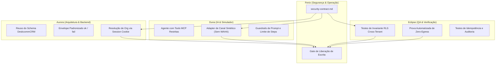

# AtendePro — Contrato de Segurança e Invariantes da Camada

> Precedência: `contract-cross-review.md` reconcilia schema, auditoria e provider `simulator`; este contrato não deve reintroduzir fallback WAHA nem nomes de tabelas inexistentes.

> **Documento:** `docs/atendepro/security-contract.md`  
> **Papel Responsável:** Fenix (Segurança, RLS, RBAC e Operação)  
> **Status:** Ativo / Baseline Contratual  
> **Data:** 2026-09-13  
> **Alvo:** Primeira Fatia Vertical AtendePro (`Onboarding` → `Configuração` → `Conversa Simulada` → `Ação Auditada no CRM`)  
> **Intersecções:** Aurora (Arquitetura), Duna (Agentes/RAG/MCP/Simulação), Eclipse (QA/E2E)

---

## 1. Contexto e Filosofia de Segurança

O **AtendePro** é uma camada de experiência e configuração simplificada sobre o motor operacional do **DeskcommCRM** (conforme [D-001](file:///mnt/c/teste/DeskcommCRM-canonical/docs/atendepro/decisions.md) e [project-brief.md](file:///mnt/c/teste/DeskcommCRM-canonical/docs/atendepro/project-brief.md)). Não é um novo banco, não é um segundo CRM e não introduz bancos de dados paralelos.

Por operar sobre o mesmo banco e motor do DeskcommCRM, qualquer falha de fronteira na camada AtendePro compromete a integridade de todas as organizações da instalação. Este contrato estabelece os **invariantes de segurança não-negociáveis** para o desenvolvimento e operação da primeira fatia vertical, amarrando arquitetura (Aurora), inteligência/simulação (Duna) e testes/verificação (Eclipse).

---

## 2. Invariantes Centrais de Segurança

### 2.1. Tenant Isolation & `organization_id` Confiável (P0)

1. **Origem Confiável do Tenant:**  
   - O `organization_id` **NUNCA** pode ser aceito a partir do `body`, `query parameters`, ou headers livres enviados pelo cliente em qualquer rota de mutação ou consulta de dados de tenant.
   - O `organization_id` deve ser resolvido **exclusivamente** de fonte autenticada e confiável:
     - Na UI / Server Actions / Route Handlers de sessão: via `loadAuthUser()` e `resolveActiveOrg()` (derivado de `user_organizations` aceito e não-revogado, referenciado em [lib/auth/server.ts](file:///mnt/c/teste/DeskcommCRM-canonical/lib/auth/server.ts)).
     - Em integrações M2M / MCP: resolvido a partir do hash do token em `api_tokens` ([lib/mcp/auth.ts](file:///mnt/c/teste/DeskcommCRM-canonical/lib/mcp/auth.ts)).
2. **Defesa em Duas Camadas (Belt and Suspenders):**
   - **Camada Aplicação:** Toda query executada deve conter explicitamente `.eq("organization_id", orgId)`.
   - **Camada Banco:** Toda tabela tenant-aware deve ter Row Level Security (RLS) habilitada (`ALTER TABLE ... ENABLE ROW LEVEL SECURITY;`) com policies baseadas na função canônica `fn_user_org_ids()` ou `fn_role_at_least()`.
3. **Impedimento de IDOR:**  
   - IDs de recursos (`contact_id`, `lead_id`, `conversation_id`, `task_id`, `appointment_id`) jamais devem ser consultados ou atualizados sem o predicado composto que amarra o recurso ao `organization_id` confiável da sessão.

### 2.2. Uso do `service_role` (Admin Client) e RLS (P0)

1. **Proibição de Bypass Imprudente:**  
   - O `createAdminClient()` ([lib/supabase/admin.ts](file:///mnt/c/teste/DeskcommCRM-canonical/lib/supabase/admin.ts)) utiliza a `SUPABASE_SERVICE_ROLE_KEY` e desativa todas as checagens de RLS no PostgreSQL.
   - O uso de `createAdminClient()` é **restrito** a rotas e processos que comprovadamente não conseguem rodar sob o contexto de sessão do usuário (ex.: webhooks de entrada após validação de assinatura, workers assíncronos em background, tarefas de cron com `INTERNAL_CRON_SECRET`).
2. **Obrigação de Filtro Manual Quando em Service Role:**
   - Se uma rota ou handler do AtendePro fizer uso de `createAdminClient()`, o filtro `.eq("organization_id", orgId)` é **obrigatório por construção**. A omissão desse filtro é classificada como vulnerabilidade Crítica (P0) e impede merge.
3. **Preferência pelo Cliente de Sessão:**  
   - Toda Server Action e Route Handler disparada por usuário autenticado no AtendePro deve instanciar `createClient()` de [lib/supabase/server.ts](file:///mnt/c/teste/DeskcommCRM-canonical/lib/supabase/server.ts), operando sob as restrições automáticas de RLS do banco.

### 2.3. RBAC & Permissões Efetivas (P1)

1. **Hierarquia de Papéis:**  
   - O AtendePro respeita a matriz hierárquica do DeskcommCRM: `viewer` < `agent` < `manager` < `admin`.
   - Verificação em runtime obrigatória via `requireRole(minRole)` ([lib/auth/require-role.ts](file:///mnt/c/teste/DeskcommCRM-canonical/lib/auth/require-role.ts)), consultando a função de banco `fn_user_role_in_org()`.
2. **Matriz de Permissões da Primeira Fatia:**
   - **Visualizar Dashboard e Métricas:** `viewer+`
   - **Operar Conversa Simulada:** `agent+`
   - **Mover Leads / Criar Contatos / Agendamentos no CRM:** `agent+`
   - **Configurar Dados do Negócio (Horários, Serviços, Preços):** `manager+`
   - **Alterar Personalidade, Regras e Prompt do Agente:** `manager+`
   - **Pausar / Reativar Agente:** `manager+`
   - **Configurações Sensíveis da Instalação / Área Técnica:** `admin` / `platform_admin`
3. **Impedimento de Auto-Promoção:**  
   - Nenhum endpoint ou interface do AtendePro pode permitir que um usuário altere seu próprio papel ou crie convites com nível de acesso superior ao seu (`user_organizations_update` permanece admin-only via RLS).

### 2.4. Zero-Egress para Simulação de WhatsApp (P0)

1. **Isolamento Total do Canal Real:**  
   - Conforme [D-004](file:///mnt/c/teste/DeskcommCRM-canonical/docs/atendepro/decisions.md) e [B-004](file:///mnt/c/teste/DeskcommCRM-canonical/docs/atendepro/blockers.md), a primeira fatia vertical opera exclusivamente em **modo simulado**.
   - É **expressamente proibido** instanciar o cliente WAHA (`getWahaClient()`) ou chamar `sendWAHA()` / `sendMessageHandler()` com destinos reais durante qualquer execução da interface AtendePro nesta fase.
2. **Canal Sintético de Simulação:**  
   - Conversas de teste devem nascer vinculadas a uma sessão de canal sintética ou mockada (ex.: `channel_session` com identificador `simulator` ou `test-channel`), marcada de forma determinística no banco.
   - A camada de envio do simulador deve desviar a mensagem para persistência direta em banco (`messages`), sem passar pela fila de despacho do WAHA (`workers/` ou `lib/waha/send.ts`).
3. **Trava em Profundidade (Circuit Breaker de Egress):**  
   - O runtime do simulador deve conter um guardrail estrito que aborta com erro se detectar tentativa de conexão de socket TCP/HTTP direcionada para endpoints externos do WhatsApp ou portas do WAHA.

### 2.5. Auditoria & Rastreabilidade (P1)

1. **Registro Obrigatório de Mutações:**  
   - Toda alteração de estado no CRM ou na configuração do negócio acionada pelo AtendePro (seja por clique do usuário ou por tool disparada pelo agente na simulação) deve invocar `audit()` ([lib/audit/index.ts](file:///mnt/c/teste/DeskcommCRM-canonical/lib/audit/index.ts)).
2. **Campos Mandatórios de Auditoria:**  
   - `organization_id` (confiável).
   - `actor` (`{ type: "user", id }` para humanos; `{ type: "agent", id, version }` para ações automáticas).
   - `action` canônica (ex.: `crm.lead.created`, `crm.stage.moved`, `atendepro.config.updated`).
   - `request_id` (correlacionado ao `X-Request-Id` injetado pelo proxy).
   - `details` (payload com estado anterior/posterior, higienizado de PII sensível).
3. **Não-Repúdio e Imutabilidade:**  
   - Nenhum usuário da aplicação (mesmo `admin`) possui permissão de `UPDATE` ou `DELETE` na tabela `api_audit_log`.

### 2.6. Idempotência (P1)

1. **Prevenção de Duplicidade no CRM:**  
   - Requisições de mutação (criação de lead, avanço de funil, agendamento de retorno) devem aceitar ou gerar chaves de idempotência determinísticas (`idempotency_key` ou `external_id` composto: `org_id:conversation_id:step`).
   - Re-execuções da mesma ação da IA ou duplo-clique do usuário devem ser no-ops seguros, capturando violações de constraint (`23505 unique_violation`) sem gerar duplicação de cards ou contatos.

### 2.7. Proteção de Segredos & Variáveis de Ambiente (P0)

1. **Zero Segredos no Frontend:**  
   - Nenhum segredo ou chave privada (`SUPABASE_SERVICE_ROLE_KEY`, `AI_CRED_AES_KEY`, `INTERNAL_SECRET`, `WAHA_API_KEY`, API keys de LLMs) pode receber o prefixo `NEXT_PUBLIC_` ou ser importada em componentes com diretiva `"use client"`.
2. **Criptografia em Repouso:**  
   - Credenciais de provedores de IA cadastradas pela organização devem ser cifradas via AES-256-GCM ([lib/crypto/aes_gcm.ts](file:///mnt/c/teste/DeskcommCRM-canonical/lib/crypto/aes_gcm.ts)) utilizando a `AI_CRED_AES_KEY`.
3. **Eliminação de Fallbacks Fracos:**  
   - Conforme mapeado no Threat Model ([T4](file:///mnt/c/teste/DeskcommCRM-canonical/docs/threat-model.md)), tokens de segurança jamais devem aceitar literais de fallback inseguros como `"dev-fallback"`. Na ausência de segredo configurado, o sistema deve falhar alto (`throw new Error(...)`).

### 2.8. Higienização de Logs & Observabilidade (P1)

1. **Proibição de PII e Segredos em Logs:**  
   - Em conformidade com as diretrizes de [lib/logger.ts](file:///mnt/c/teste/DeskcommCRM-canonical/lib/logger.ts), é estritamente proibido registrar em logs (console, Pino ou Sentry):
     - Mensagens brutas trocadas no chat simulado.
     - CPF, telefones reais ou e-mails de clientes.
     - Tokens bearer, senhas ou strings de conexão.
2. **Logs Estruturados e Resumos Sanitizados:**  
   - Logs de execução do agente no simulador devem registrar apenas métricas operacionais: `tokens_used`, `duration_ms`, `tool_name`, `status`, `request_id` e `organization_id`.

---

## 3. Matriz de Priorização de Invariantes

| ID | Invariante | Prioridade | Escopo / Mecânica de Garantia |
|---|---|---|---|
| **INV-01** | **Tenant Boundary Estrito** | **P0** | RLS obrigatória em toda tabela + resolução de `organization_id` exclusivamente via sessão confiável. |
| **INV-02** | **Zero-Egress no Simulador** | **P0** | Canal de teste sem conexão com WAHA/WhatsApp real; bloqueio absoluto de saídas HTTP/sockets externos de mensageria. |
| **INV-03** | **Blindagem de Segredos** | **P0** | Sem chaves no bundle do navegador; `AI_CRED_AES_KEY` obrigatória para credenciais; sem fallbacks literais inseguros. |
| **INV-04** | **Restrição de Service-Role** | **P0** | Handlers de interface usam client com RLS; se service-role for indispensável, filtro manual de org é mandatório. |
| **INV-05** | **RBAC na Configuração e Ações** | **P1** | `requireRole("manager")` para alterar regras do atendente e catálogo; `requireRole("agent")` para simular e operar CRM. |
| **INV-06** | **Auditoria de Mutações** | **P1** | Chamada a `audit()` em toda ação no CRM gerada via UI ou simulador; trilha imutável. |
| **INV-07** | **Idempotência de Efeitos no CRM** | **P1** | Chaves únicas de transação para criação de leads, contatos e etapas; tolerância a re-execuções. |
| **INV-08** | **Sanitização de Logs (LGPD)** | **P1** | Zero PII e zero mensagens de conversa nos logs e no Sentry. |
| **INV-09** | **Circuit Breaker de Orçamento de IA** | **P2** | Limite máximo de steps e tokens por turno na simulação; respeito ao `AI_BUDGET_ENFORCEMENT`. |
| **INV-10** | **Rate Limiting em Operações Sensíveis** | **P2** | Proteção contra spam de requisições nos endpoints de simulação e salvamento de configuração. |

---

## 4. Cruzamento Interdisciplinar (Aurora, Duna, Eclipse)

### 4.1. Cruzamento com Aurora (Arquitetura & Integração)
- **Aderência ao Schema:** O AtendePro reutiliza diretamente as entidades `organizations`, `user_organizations`, `ai_agents`, `contacts`, `conversations`, `messages`, `crm_leads`, `crm_pipelines` e `crm_stages`. Não serão criadas tabelas redundantes.
- **Envelope de Resposta:** Todas as rotas de API da camada devem utilizar os wrappers canônicos `ok()` e `fail()` de [lib/api/wrappers.ts](file:///mnt/c/teste/DeskcommCRM-canonical/lib/api/wrappers.ts), garantindo headers `X-Request-Id` e códigos de erro semânticos (`unauthenticated`, `forbidden_role`, `forbidden_tenant`, `validation_failed`).
- **Contrato de Sessão:** O middleware [proxy.ts](file:///mnt/c/teste/DeskcommCRM-canonical/proxy.ts) e o helper [lib/auth/server.ts](file:///mnt/c/teste/DeskcommCRM-canonical/lib/auth/server.ts) formam o ponto focal de entrada. Rotas novas da fatia AtendePro **não** devem ser adicionadas a `PUBLIC_PATHS`.

### 4.2. Cruzamento com Duna (Agentes, RAG, MCP & Simulação)
- **Tools Confinadas:** As ferramentas MCP disponibilizadas para o agente durante a conversa simulada (`create_lead`, `update_stage`, `schedule_appointment`) devem obrigatoriamente injetar o `organization_id` da sessão nos parâmetros de execução, sem permitir que o modelo defina o tenant alvo.
- **RAG com Escopo Restrito:** Se a base de conhecimento for acionada no simulador, a busca vetorial / embeddings (`ai_chunks`) deve conter cláusula estrita de tenant (`organization_id = active_org`), impedindo vazamento de acervo entre empresas.
- **Stub / Mock Seguro:** Em ambiente local de desenvolvimento, caso não haja provedor LLM configurado, o simulador deve operar com stub determinístico ([INTERNAL_AGENT_RUN_STUB](file:///mnt/c/teste/DeskcommCRM-canonical/lib/env.ts)) sem tentar bater em gateways remotos.

### 4.3. Cruzamento com Eclipse (QA, E2E & Performance)
- **Bateria de Invariantes Obrigatória:** Nenhuma rota ou tela da fatia AtendePro será considerada concluída sem a criação de testes de invariante (padrão [tests/invariants/](file:///mnt/c/teste/DeskcommCRM-canonical/tests/invariants/)), cobrindo:
  1. *Prova de Isolamento:* Usuário da Org B recebe `403` ou `0 rows` ao tentar acessar dados da Org A via endpoints do AtendePro.
  2. *Prova de Zero-Egress:* Asserção explícita de que zero requisições saem para o WAHA durante um ciclo completo de simulação.
  3. *Prova de RBAC:* Asserção de que `agent` recebe `403 forbidden_role` ao tentar alterar horários ou personalidade do atendente.
  4. *Prova de Auditoria:* Confirmação de que a linha correspondente em `api_audit_log` foi gravada com o `actor` correto após a ação simulada.

---

## 5. Gates para Liberação de Escrita (Critérios de Aceite de Segurança)

Para que a implementação saia do estado de leitura e rascunho de contratos para código executável com escrita em banco e no CRM, os seguintes gates devem ser satisfeitos e validados formalmente:

- [ ] **Gate G-SEC-01 (Aprovação deste Contrato):** Aprovação unânime do contrato de segurança entre os papéis (Fenix, Aurora, Duna, Boreal, Cometa, Eclipse).
- [ ] **Gate G-SEC-02 (Validação Estática de Rotas):** Toda nova rota ou Server Action possui Zod schema para validação de entrada, `requireRole` com rank adequado e `resolveActiveOrg()`.
- [ ] **Gate G-SEC-03 (Isolamento Comprovado por Teste):** Existência de teste de invariante que simula JWT cross-tenant e prova que um tenant não lê nem escreve no outro.
- [ ] **Gate G-SEC-04 (Trava Física de Egress):** Validação por teste automatizado de que o simulador opera 100% isolado de canais externos e que nenhuma chamada ao WAHA é emitida.
- [ ] **Gate G-SEC-05 (Auditoria Ativa):** Verificação de que a execução ponta a ponta da fatia vertical gera os eventos auditáveis correspondentes com `actor` e `organization_id`.
- [ ] **Gate G-SEC-06 (Revisão de PII e Logs):** Varredura de logs da fatia vertical para assegurar que nenhum dado sensível do cliente ou do negócio seja impresso em console ou gravado indevidamente.

---

*Assinado: **Fenix** (Segurança, RLS, RBAC e Operação)*  
*Referência do Repositório: `DeskcommCRM-canonical`*
